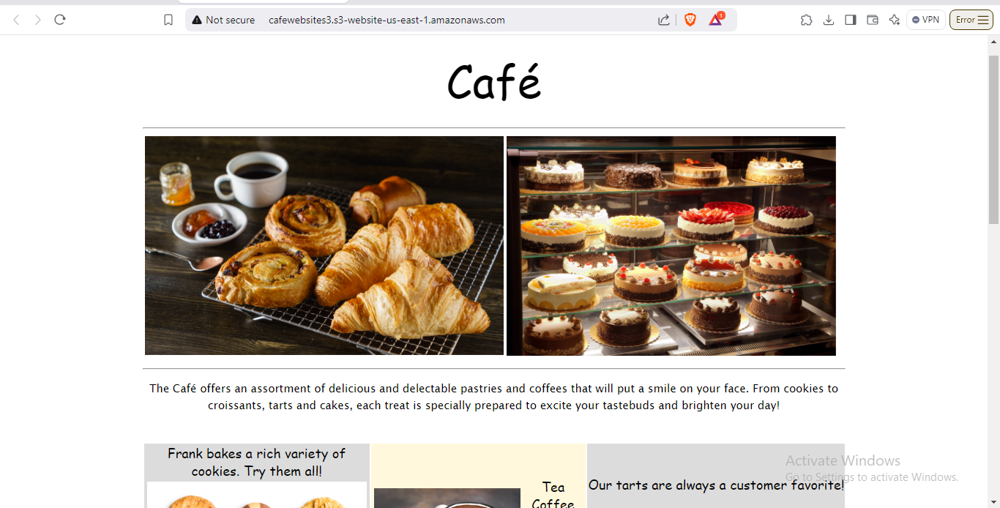
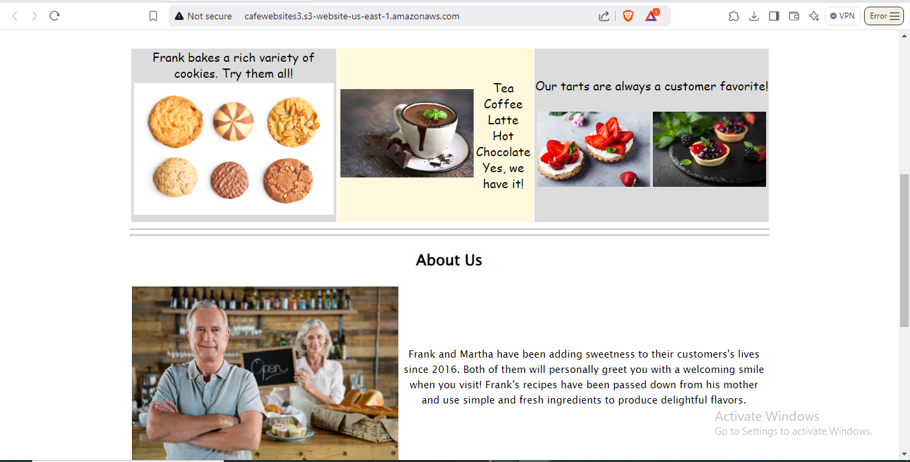
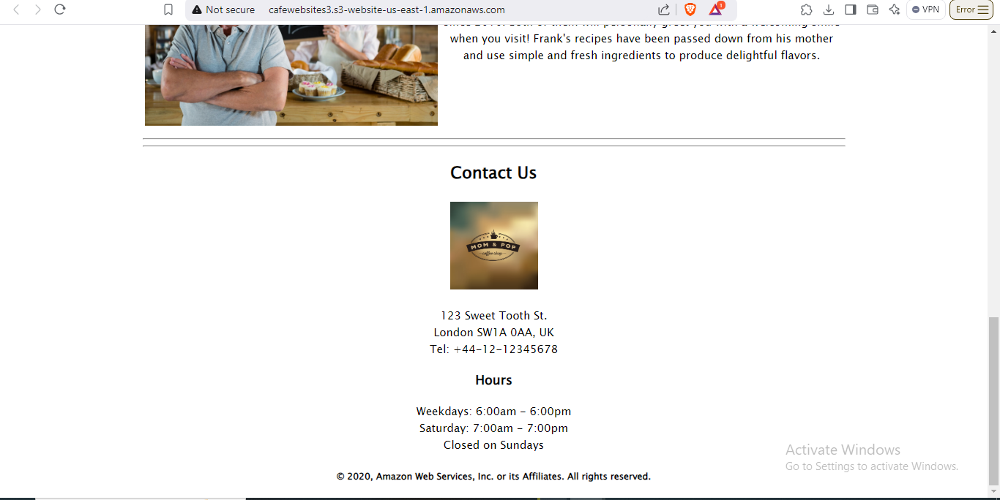
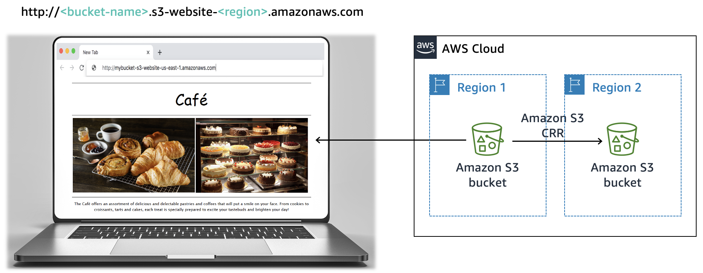
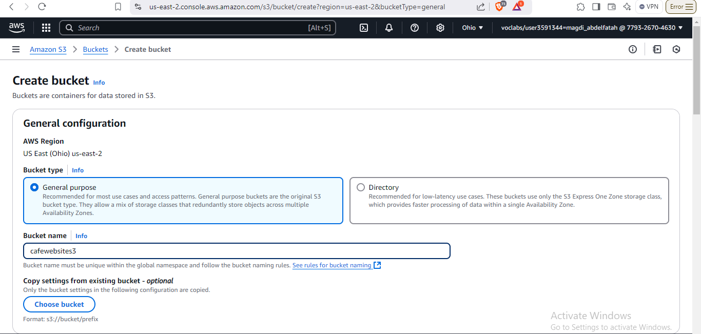
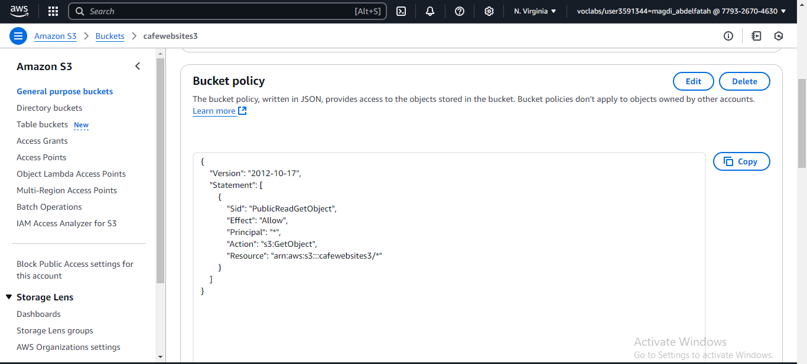
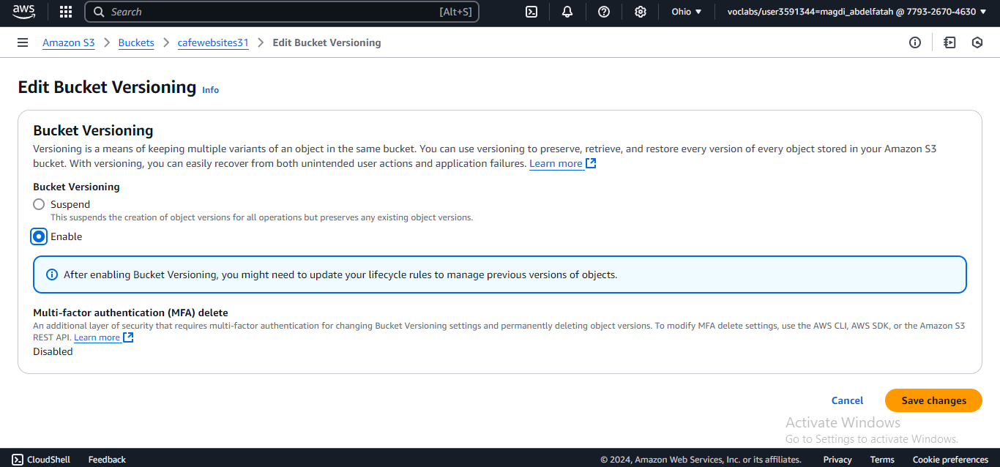
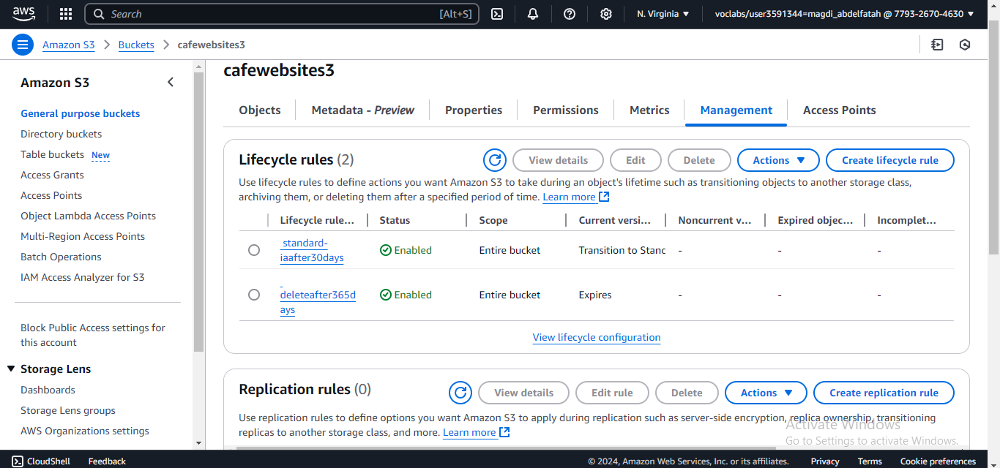

Static Website for Café
Project Description
This project involves creating a static website for a café using Amazon S3. The website showcases the café's offerings and provides business details like location, hours, and contact information. It also implements best practices for data protection, cost optimization, and disaster recovery.

Key Features
Static Website Hosting:

Hosted using Amazon S3.
Accessible via a public S3 bucket endpoint.
Data Protection:

Enabled versioning to protect against accidental deletions or overwrites.
Applied bucket policies to manage public read access.
Cost Optimization:

Configured lifecycle policies:
Move previous versions of objects to S3 Standard-IA after 30 days.
Delete objects after 365 days.
Disaster Recovery:

Ensured architectural best practices for data redundancy.
Project Architecture

Files and Directories

index.html: Main website file.

images/: Contains all website images.

css/: CSS stylesheets for the website.

Steps to Reproduce

Create an S3 Bucket:

Use the AWS Management Console to create an S3 bucket.
Enable static website hosting and upload project files.

Apply Bucket Policies:

Add a bucket policy for public read access.

Enable Versioning:

Enable versioning for the bucket to prevent accidental data loss.

Set Lifecycle Policies:

Create rules to transition old versions to S3 Standard-IA and delete them after 365 days.

Technologies Used

AWS S3

HTML

CSS